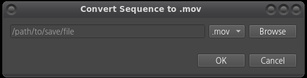

# Shotgrid_AMI_converter

Shotgrid의 PublishedFile 엔티티에 존재하는 레코드의 필드값을 파싱하여<br>로컬 경로에 존재하는 이미지 시퀀스를 비디오로 변환하여 저장하는 프로그램.<br>
로직을 응용하여 추가적인 기능 구현 가능

## 모듈 및 프레임워크

- PySide2
```bash
pip install PySide2
```
- shotgun_api3
```bash
pip install shotgun_api3
```
- [ffmpeg 4.2.4](https://ffmpeg.org/releases/ffmpeg-4.2.4.tar.xz)
```bash
wget https://ffmpeg.org/releases/ffmpeg-4.2.4.tar.xz
```

## 사용 방법

### 1. shotgrid에 [커스텀 AMI 추가](https://help.autodesk.com/view/SGDEV/ENU/?guid=SGD_ami_action_menu_items_create_html)

<div align="center">
   
</div>  

<div align="center">
   <h4> ▲ Action Menu Items 엔티티에 커스텀 액션 메뉴 추가
</div>

<br>

<div align="center">
   
</div>  

<div align="center">  
    <h4> ▲ Context Menu에 커스텀 액션 메뉴 표시
</div>
<br>

### 2. 코드 수정 (script_key, 경로, 설정값 등)

### 3. [커스텀 프로토콜](https://stackoverflow.com/questions/32064229/custom-protocol-handlers-linux-centos-7-for-chrome) 추가  

<div align="center">
   
</div>  

<div align="center">
   <h4> ▲ .desktop 파일 작성
</div>

<br>

<div align="center">
   
</div>  

<div align="center">
   <h4> ▲ mimeapps.list에 내용 추가
</div>

<br>

```bash
update-desktop-database ~/.local/share/applications/
```
<div align="center">
   <h4> ▲ 변경 사항 업데이트
</div>

<br>

```bash
xdg-mime query default x-scheme-handler/shotgrid
# > shotgrid.desktop
```
<div align="center">
   <h4> ▲ 커스텀 프로토콜 등록 검증
</div>

### 4. AMI 실행
<div align="center">
   
</div>  

<div align="center">  
    <h4> ▲ AMI를 통해 스크립트가 실행된 모습
</div>

## 라이센스
[The Unilicense](https://unlicense.org/)

## 제작자
Email: td.junopark@gmail.com<br>
Github: https://github.com/junopark00<br>
Pull Requests: https://github.com/junopark00/ShotGrid_AMI_convert/pulls
